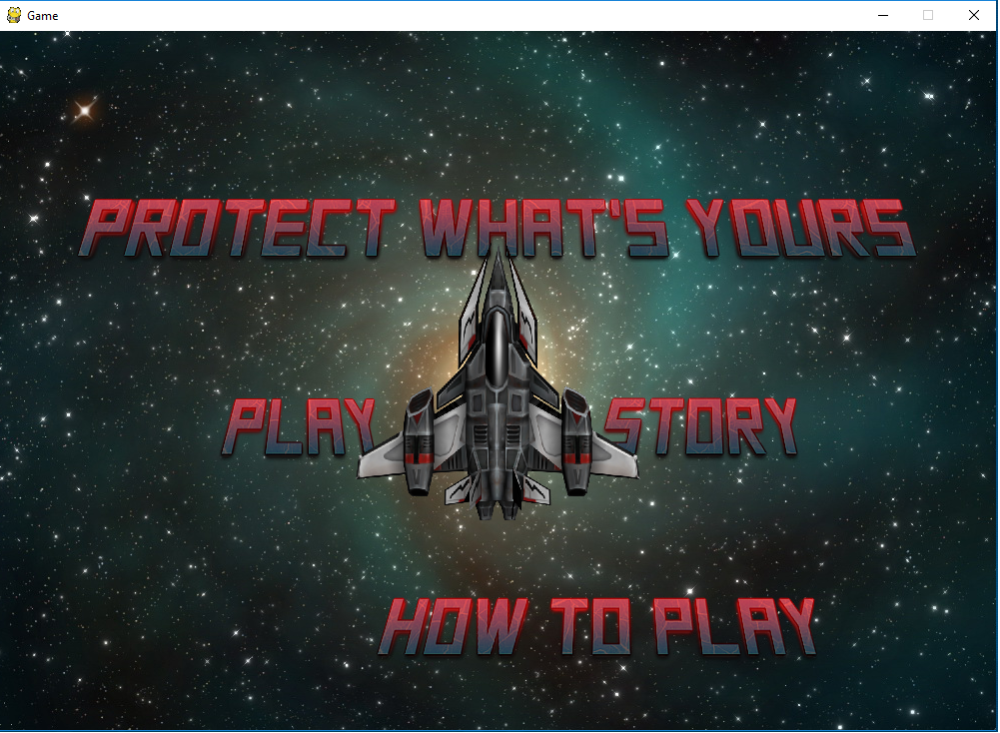
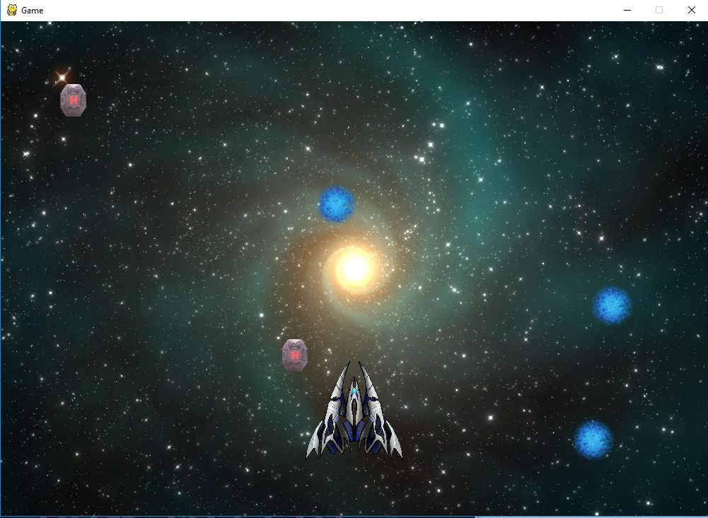

# aliengame

<h2>Requirements<h2>
<a href = "https://www.python.org/downloads/">Python</a>
<a href = "https://www.lfd.uci.edu/~gohlke/pythonlibs/#pygame">PyGame</a>
<a href = "https://www.youtube.com/watch?v=_GikMdhAhv0">How To Install</a>

  The galaxy is being overrun by evil doers and others that want to harm the earth. They are not aliens, they are humans who have lost all control over their minds. It is up to you to save the galaxy and find the cure to restore peace to everyone's minds and souls. You will need to fight through waves of ships shooting at you and you will need to kill each ship and collect power ups and health packs on the way. You will need to kill all the ships and collect one of the pieces for the machine that will restore peace and prosperity in the world. You will fight the final boss and then make your way to the machine to restore peace into the world.

 
  The way you will play this game is that you will control your fighter ship and will shoot. You will have to kill all the ships in your path and get through waves of ships and destroy all of them because you can pass through. You can collect health pods if you lose health. You would lose health by one of the enemy ships colliding with you. You will need to shoot all of the enemy ships down. You will need to kill all opposing aliens to get through the wave. Once you get through the final wave you will pick up a part and will carry that apart to the final boss fight where you will have to fight the boss and there will be fireballs being shot out of the boss coming at you. If they hit you, you will lose health and if your ship’s health gets less than 1 you will die and the game will be over. If you kill the boss you will have to put the final part into the machine and all peace will be restored in the world.

